# Entity-Relationship Diagram (ERD) for OwnerIQ Database Schema

This ERD represents the database structure based on the provided schema.sql file. It includes main entities, their attributes, and relationships.

```mermaid
erDiagram
    PERSON ||--o{ PROPERTY : owns
    PERSON ||--o{ PERSON_CONTACT : has
    PERSON ||--o{ PERSON_ADDRESS : has
    PERSON ||--|| INVESTOR_PROFILE : has
    PERSON ||--o{ FUNDING_PROFILE : has
    PERSON ||--o{ BUY_BOX : has
    PERSON ||--o{ WATCHLIST : has
    PERSON ||--o{ SAVED_SEARCH : has
    PERSON ||--o{ RECOMMENDATION_LOG : receives
    PERSON ||--o{ PORTFOLIO_MEMBER : member_of
    PERSON ||--o{ CONSENT_EVENT : has
    PERSON ||--o{ TENANT : is_tenant_for

    PROPERTY ||--o{ PROPERTY_VALUATION : has
    PROPERTY ||--o{ PROPERTY_RENT_ESTIMATE : has
    PROPERTY ||--o{ PROPERTY_OPERATING_INPUTS : has
    PROPERTY ||--o{ PROPERTY_LOAN : has
    PROPERTY ||--o{ PROPERTY_METRICS : has
    PROPERTY ||--o{ PROPERTY_DEALSCORE : has
    PROPERTY ||--o{ WATCHLIST_ITEM : in_watchlist
    PROPERTY ||--o{ RECOMMENDATION_LOG : recommended_for
    PROPERTY ||--o{ TENANT : has_tenants

    REGION ||--o{ MARKET_STATS : has
    REGION ||--o{ BUY_BOX_MARKET : referenced_by

    PORTFOLIO ||--o{ PORTFOLIO_MEMBER : has_members

    DEALSCORE_RULE_SET ||--o{ PROPERTY_DEALSCORE : used_by
    DEALSCORE_RULE_SET ||--o{ RECOMMENDATION_LOG : used_by

    BUY_BOX ||--o{ BUY_BOX_MARKET : has
    BUY_BOX ||--o{ BUY_BOX_PROPERTY_TYPE : has

    WATCHLIST ||--o{ WATCHLIST_ITEM : contains

    PERSON {
        UUID person_id PK
        person_kind kind
        TEXT full_name
        TEXT first_name
        TEXT last_name
        TEXT primary_email UK
        TEXT primary_phone
        DATE dob
        TEXT tax_id_hash
        TIMESTAMPTZ created_at
    }

    PROPERTY {
        UUID property_id PK
        UUID person_id FK
        TEXT address
        NUMERIC valuation
        NUMERIC rent
        NUMERIC taxes
        NUMERIC insurance
        NUMERIC hoa
        NUMERIC maintenance
        NUMERIC vacancy
        NUMERIC loan_rate
        INT loan_term
        NUMERIC ltv
        TIMESTAMPTZ created_at
    }

    PERSON_CONTACT {
        UUID contact_id PK
        UUID person_id FK
        contact_kind kind
        TEXT value
        BOOLEAN is_primary
        TIMESTAMPTZ created_at
    }

    PERSON_ADDRESS {
        UUID address_id PK
        UUID person_id FK
        address_kind kind
        TEXT line1
        TEXT line2
        TEXT city
        TEXT state_code
        TEXT postal_code
        TEXT country_code
        TIMESTAMPTZ created_at
    }

    INVESTOR_PROFILE {
        UUID person_id PK,FK
        kyc_status kyc_status
        accreditation accreditation_status
        risk_tolerance risk_tolerance
        INT investment_horizon_y
        NUMERIC annual_income_usd
        NUMERIC net_worth_usd
        NUMERIC liquidity_usd
        TEXT notes
        TIMESTAMPTZ updated_at
    }

    FUNDING_PROFILE {
        UUID funding_id PK
        UUID person_id FK
        NUMERIC cash_available_usd
        NUMERIC target_ltv_pct
        BOOLEAN prefers_fixed
        TEXT preferred_lenders
        TIMESTAMPTZ updated_at
    }

    BUY_BOX {
        UUID buy_box_id PK
        UUID person_id FK
        TEXT name
        NUMERIC min_price_usd
        NUMERIC max_price_usd
        NUMERIC min_coc
        NUMERIC min_cap_rate
        NUMERIC min_dscr
        NUMERIC max_vacancy_pct
        NUMERIC target_ltv_pct
        invest_strategy strategy
        NUMERIC climate_risk_max
        property_type[] property_types
        BOOLEAN is_active
        TIMESTAMPTZ created_at
    }

    BUY_BOX_MARKET {
        UUID id PK
        UUID buy_box_id FK
        UUID region_id FK
        NUMERIC weight
    }

    BUY_BOX_PROPERTY_TYPE {
        UUID id PK
        UUID buy_box_id FK
        property_type type
    }

    WATCHLIST {
        UUID watchlist_id PK
        UUID person_id FK
        TEXT name
        TIMESTAMPTZ created_at
    }

    WATCHLIST_ITEM {
        UUID id PK
        UUID watchlist_id FK
        UUID property_id FK
        TIMESTAMPTZ added_at
    }

    SAVED_SEARCH {
        UUID saved_search_id PK
        UUID person_id FK
        TEXT name
        JSONB query_json
        TIMESTAMPTZ created_at
    }

    RECOMMENDATION_LOG {
        UUID rec_id PK
        UUID person_id FK
        UUID property_id FK
        UUID rule_set_id FK
        DATE as_of_date
        NUMERIC dealscore
        NUMERIC cap_rate
        NUMERIC cash_on_cash
        NUMERIC dscr
        NUMERIC cash_needed_usd
        decision_kind decision
        TIMESTAMPTZ decision_time
        TEXT why
        TEXT risks
        TIMESTAMPTZ created_at
    }

    PORTFOLIO {
        UUID portfolio_id PK
        UUID owner_user_id
        TEXT name
        TIMESTAMPTZ created_at
    }

    PORTFOLIO_MEMBER {
        UUID portfolio_id PK,FK
        UUID person_id PK,FK
        portfolio_role role
        TIMESTAMPTZ added_at
    }

    CONSENT_EVENT {
        UUID consent_id PK
        UUID person_id FK
        consent_kind kind
        BOOLEAN granted
        TEXT scope
        TIMESTAMPTZ event_time
    }

    TENANT {
        UUID tenant_id PK
        UUID person_id FK
        TEXT name
        TEXT email
        TEXT phone
        UUID property_id FK
        DATE lease_start
        DATE lease_end
        NUMERIC rent_amount
        TIMESTAMPTZ created_at
    }

    PROPERTY_VALUATION {
        UUID valuation_id PK
        UUID property_id FK
        NUMERIC amount_usd
        DATE as_of_date
        TEXT source
        TIMESTAMPTZ created_at
    }

    PROPERTY_RENT_ESTIMATE {
        UUID rent_id PK
        UUID property_id FK
        NUMERIC market_rent_month
        DATE as_of_date
        TEXT source
        TIMESTAMPTZ created_at
    }

    PROPERTY_OPERATING_INPUTS {
        UUID input_id PK
        UUID property_id FK
        NUMERIC vacancy_rate_pct
        NUMERIC taxes_annual
        NUMERIC insurance_annual
        NUMERIC hoa_monthly
        NUMERIC maintenance_pct
        NUMERIC other_opex_annual
        TIMESTAMPTZ created_at
    }

    PROPERTY_LOAN {
        UUID loan_id PK
        UUID property_id FK
        NUMERIC interest_rate_pct
        INT term_months
        NUMERIC ltv_pct
        NUMERIC principal_usd
        TIMESTAMPTZ created_at
    }

    PROPERTY_METRICS {
        UUID metrics_id PK
        UUID property_id FK
        NUMERIC noi
        NUMERIC cap_rate
        NUMERIC cash_on_cash
        NUMERIC dscr
        NUMERIC cash_flow_net
        NUMERIC debt_service_ann
        DATE as_of_date
        TIMESTAMPTZ created_at
    }

    PROPERTY_DEALSCORE {
        UUID dealscore_id PK
        UUID property_id FK
        UUID rule_set_id FK
        NUMERIC dealscore
        NUMERIC cap_rate_norm
        NUMERIC coc_norm
        NUMERIC dscr_norm
        NUMERIC appreciation_norm
        NUMERIC risk_norm
        NUMERIC liquidity_norm
        TEXT recommendation
        TEXT explanation
        DATE as_of_date
        TIMESTAMPTZ created_at
    }

    REGION {
        UUID region_id PK
        TEXT state_code
        TEXT city
        TEXT zip_code
        TEXT msa_name
        TIMESTAMPTZ created_at
    }

    MARKET_STATS {
        UUID stats_id PK
        UUID region_id FK
        INT days_on_market
        NUMERIC appreciation_yoy
        NUMERIC vacancy_rate
        INT inventory
        NUMERIC price_cut_rate
        DATE as_of_date
        TIMESTAMPTZ created_at
    }

    DEALSCORE_RULE_SET {
        UUID rule_set_id PK
        TEXT name
        NUMERIC cap_weight
        NUMERIC coc_weight
        NUMERIC dscr_weight
        NUMERIC appreciation_weight
        NUMERIC risk_weight
        NUMERIC liquidity_weight
        TIMESTAMPTZ created_at
    }
```

## Notes
- Relationships are based on foreign keys in the schema.
- Cardinalities: ||--o{ means one-to-many (one entity can have many related entities).
- ||--|| means one-to-one.
- Some entities like TENANT are from simple_schema.sql, included for completeness.
- Enums are referenced but not detailed here.