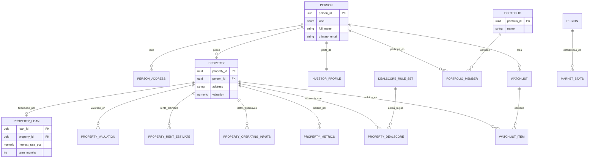

# Diagrama Entidad-Relación Completo para OwnerIQ

## Entidades y Atributos Detallados

### Tablas Principales

#### 1. `person` - Personas
- **person_id** UUID PK
- kind (tipo: 'individual', 'organization', etc.) ENUM
- full_name TEXT
- first_name TEXT
- last_name TEXT
- primary_email TEXT
- primary_phone TEXT
- external_ref TEXT
- dob DATE
- tax_id_hash TEXT
- created_at TIMESTAMPTZ

#### 2. `person_address` - Direcciones
- **address_id** UUID PK
- person_id UUID FK → person
- kind (tipo: 'home', 'mailing', 'office', 'other') ENUM
- line1 TEXT
- line2 TEXT
- city TEXT
- state_code TEXT
- postal_code TEXT
- country_code TEXT
- created_at TIMESTAMPTZ

#### 3. `property` - Propiedades
- **property_id** UUID PK
- person_id UUID FK → person
- address TEXT
- valuation NUMERIC
- rent NUMERIC
- taxes NUMERIC
- insurance NUMERIC
- hoa NUMERIC
- maintenance NUMERIC
- vacancy NUMERIC
- loan_rate NUMERIC
- loan_term INT
- ltv NUMERIC
- created_at TIMESTAMPTZ

#### 4. `property_loan` - Préstamos
- **loan_id** UUID PK
- property_id UUID FK → property
- interest_rate_pct NUMERIC
- term_months INT
- ltv_pct NUMERIC
- principal_usd NUMERIC
- created_at TIMESTAMPTZ

#### 5. `portfolio` - Portafolios
- **portfolio_id** UUID PK
- owner_user_id UUID
- name TEXT
- created_at TIMESTAMPTZ

### Tablas de Métricas

#### 6. `property_valuation` - Valoraciones
- **valuation_id** UUID PK
- property_id UUID FK → property
- amount_usd NUMERIC
- as_of_date DATE
- source TEXT
- created_at TIMESTAMPTZ

#### 7. `property_rent_estimate` - Estimaciones de Renta
- **rent_id** UUID PK
- property_id UUID FK → property
- market_rent_month NUMERIC
- as_of_date DATE
- source TEXT
- created_at TIMESTAMPTZ

#### 8. `property_operating_inputs` - Datos Operativos
- **input_id** UUID PK
- property_id UUID FK → property
- vacancy_rate_pct NUMERIC
- taxes_annual NUMERIC
- insurance_annual NUMERIC
- hoa_monthly NUMERIC
- maintenance_pct NUMERIC
- other_opex_annual NUMERIC
- created_at TIMESTAMPTZ

#### 9. `property_metrics` - Métricas de Rendimiento
- **metrics_id** UUID PK
- property_id UUID FK → property
- noi NUMERIC
- cap_rate NUMERIC
- cash_on_cash NUMERIC
- dscr NUMERIC
- cash_flow_net NUMERIC
- debt_service_ann NUMERIC
- as_of_date DATE
- created_at TIMESTAMPTZ

#### 10. `property_dealscore` - Puntuación de Oportunidad
- **dealscore_id** UUID PK
- property_id UUID FK → property
- rule_set_id UUID FK → dealscore_rule_set
- dealscore NUMERIC
- cap_rate_norm NUMERIC
- coc_norm NUMERIC
- dscr_norm NUMERIC
- appreciation_norm NUMERIC
- risk_norm NUMERIC
- liquidity_norm NUMERIC
- recommendation TEXT
- explanation TEXT
- as_of_date DATE
- created_at TIMESTAMPTZ

### Tablas de Relaciones

#### 11. `portfolio_member` - Miembros de Portafolio
- **portfolio_id** UUID PK, FK → portfolio
- **person_id** UUID PK, FK → person
- role ENUM ('owner', 'manager', 'viewer')
- added_at TIMESTAMPTZ

#### 12. `watchlist_item` - Elementos en Observación
- **id** UUID PK
- watchlist_id UUID FK → watchlist
- property_id UUID FK → property
- added_at TIMESTAMPTZ

### Tablas Auxiliares

#### 13. `region` - Regiones
- **region_id** UUID PK
- state_code TEXT
- city TEXT
- zip_code TEXT
- msa_name TEXT
- created_at TIMESTAMPTZ

#### 14. `dealscore_rule_set` - Conjunto de Reglas
- **rule_set_id** UUID PK
- name TEXT
- cap_weight NUMERIC
- coc_weight NUMERIC
- dscr_weight NUMERIC
- appreciation_weight NUMERIC
- risk_weight NUMERIC
- liquidity_weight NUMERIC
- created_at TIMESTAMPTZ

#### 15. `investor_profile` - Perfiles de Inversores
- **person_id** UUID PK, FK → person
- kyc_status ENUM
- accreditation_status ENUM
- risk_tolerance ENUM
- investment_horizon_y INT
- annual_income_usd NUMERIC
- net_worth_usd NUMERIC
- liquidity_usd NUMERIC
- notes TEXT
- updated_at TIMESTAMPTZ

## Relaciones

### Relaciones 1:N (Uno a Muchos)

1. **person → person_address**
   - Una persona puede tener múltiples direcciones

2. **person → property**
   - Una persona puede poseer múltiples propiedades

3. **person → watchlist**
   - Una persona puede tener múltiples listas de observación

4. **property → property_valuation**
   - Una propiedad puede tener múltiples valoraciones a lo largo del tiempo

5. **property → property_rent_estimate**
   - Una propiedad puede tener múltiples estimaciones de renta a lo largo del tiempo

6. **property → property_metrics**
   - Una propiedad puede tener múltiples cálculos de métricas a lo largo del tiempo

7. **property → property_dealscore**
   - Una propiedad puede tener múltiples puntuaciones de oportunidad

### Relaciones 1:1 (Uno a Uno)

1. **property → property_loan**
   - Una propiedad puede tener un préstamo asociado

2. **person → investor_profile**
   - Una persona puede tener un perfil de inversor

### Relaciones N:M (Muchos a Muchos)

1. **person ↔ portfolio** (a través de portfolio_member)
   - Una persona puede pertenecer a múltiples portafolios, y un portafolio puede tener múltiples personas

2. **property ↔ watchlist** (a través de watchlist_item)
   - Una propiedad puede estar en múltiples listas de observación, y una lista puede contener múltiples propiedades

## Tipos Enumerados

1. **person_kind**: 'individual', 'organization'
2. **address_kind**: 'home', 'mailing', 'office', 'other'
3. **kyc_status**: 'pending', 'in_review', 'verified', 'rejected', 'expired'
4. **accreditation**: 'unknown', 'non_accredited', 'accredited_rule501', 'qualified_purchaser'
5. **risk_tolerance**: 'conservative', 'moderate', 'aggressive'
6. **invest_strategy**: 'cashflow', 'appreciation', 'brrrr', 'flip', 'short_term_rental', 'mixed'
7. **portfolio_role**: 'owner', 'manager', 'viewer'
8. **property_type**: 'single_family', 'townhouse', 'condo', 'multi_family', 'commercial'
9. **decision_kind**: 'accepted', 'considering', 'dismissed', 'notified'

## Diagrama ER Completo

El siguiente diagrama muestra las entidades principales y sus relaciones:

## Consideraciones de Diseño

1. **Uso de UUIDs**: Todas las tablas utilizan UUIDs como claves primarias para facilitar la distribución de datos y evitar colisiones.

2. **Modelo de Polimorfismo**: El campo `kind` en la tabla `person` implementa un patrón de herencia de tabla única, permitiendo flexibilidad en los tipos de usuarios.

3. **Timestamps Consistentes**: Todas las tablas incluyen `created_at` para seguimiento y auditoría.

4. **Separación de Preocupaciones**: Las métricas y análisis se almacenan separados de los datos básicos de las propiedades.

5. **Campos Históricos**: Las tablas de métricas incluyen `as_of_date` para permitir el seguimiento histórico de cambios.

6. **Integridad Referencial**: Las claves foráneas mantienen la integridad de las relaciones entre entidades.

## Índices y Optimización

1. **Índices Únicos**:
   - `primary_email` en `person`
   - Combinación `buy_box_id` y `region_id` en `buy_box_market`

2. **Índices Compuestos**:
   - `person_id` y `as_of_date` en `recommendation_log`

3. **Vistas Materializadas**:
   - `v_person_active_buy_box`: Muestra el buy box activo más reciente por persona
   - `v_last_recommendation`: Muestra la última recomendación por persona y propiedad

Este diagrama entidad-relación completo proporciona una visión exhaustiva del modelo de datos de OwnerIQ, mostrando todas las entidades, atributos y relaciones importantes.