# Diagrama Entidad-Relación Completo (ERD) para OwnerIQ

Este documento presenta una visualización completa de todas las tablas y relaciones en la base de datos de OwnerIQ, basado en el archivo schema.sql.

## Diagrama ERD Completo

```mermaid
erDiagram
    %% Relaciones principales de person
    person ||--o{ person_address : has
    person ||--o{ person_contact : has
    person ||--o{ property : owns
    person ||--o{ watchlist : has
    person ||--o{ saved_search : has
    person ||--o{ buy_box : has
    person ||--o| investor_profile : has
    person ||--o| funding_profile : has
    person }o--o{ portfolio : member_of
    person ||--o{ consent_event : has
    person }o--o{ recommendation_log : receives

    %% Relaciones de property
    property ||--o{ property_valuation : has
    property ||--o{ property_rent_estimate : has
    property ||--o{ property_operating_inputs : has
    property ||--o{ property_loan : has
    property ||--o{ property_metrics : has
    property ||--o{ property_dealscore : has
    property }o--o{ recommendation_log : is_recommended
    
    %% Relaciones de watchlist
    watchlist ||--o{ watchlist_item : contains
    watchlist_item }o--|| property : references
    
    %% Relaciones de region
    region ||--o{ market_stats : has
    region }o--o{ buy_box_market : targeted_in
    
    %% Relaciones de buy_box
    buy_box ||--o{ buy_box_market : has
    buy_box_market }o--|| region : references
    buy_box ||--o{ buy_box_property_type : prefers
    
    %% Relaciones de dealscore
    dealscore_rule_set ||--o{ property_dealscore : used_by
    dealscore_rule_set ||--o{ recommendation_log : used_by
    
    %% Relaciones de portfolio
    portfolio ||--o{ portfolio_member : has
    portfolio_member }o--|| person : includes

    %% Definición de entidades
    person {
        UUID person_id PK
        person_kind kind "individual/organization"
        TEXT full_name
        TEXT first_name
        TEXT last_name
        TEXT primary_email UK
        TEXT primary_phone
        TEXT external_ref
        DATE dob
        TEXT tax_id_hash
        TIMESTAMPTZ created_at
    }

    person_address {
        UUID address_id PK
        UUID person_id FK
        address_kind kind "home/mailing/office/other"
        TEXT line1
        TEXT line2
        TEXT city
        TEXT state_code
        TEXT postal_code
        TEXT country_code
        TIMESTAMPTZ created_at
        %% FALTA: BOOLEAN is_primary (usado en código pero no en schema)
    }

    person_contact {
        UUID contact_id PK
        UUID person_id FK
        contact_kind kind
        TEXT value
        BOOLEAN is_primary
        TIMESTAMPTZ created_at
    }

    property {
        UUID property_id PK
        UUID person_id FK
        TEXT address
        NUMERIC valuation
        NUMERIC rent
        NUMERIC taxes
        NUMERIC insurance
        NUMERIC hoa
        NUMERIC maintenance
        NUMERIC vacancy
        NUMERIC loan_rate
        INT loan_term
        NUMERIC ltv
        TIMESTAMPTZ created_at
    }
    
    portfolio {
        UUID portfolio_id PK
        UUID owner_user_id
        TEXT name
        TIMESTAMPTZ created_at
    }
    
    portfolio_member {
        UUID portfolio_id PK,FK
        UUID person_id PK,FK
        portfolio_role role
        TIMESTAMPTZ added_at
    }
    
    investor_profile {
        UUID person_id PK,FK
        kyc_status kyc_status
        accreditation accreditation_status
        risk_tolerance risk_tolerance
        INT investment_horizon_y
        NUMERIC annual_income_usd
        NUMERIC net_worth_usd
        NUMERIC liquidity_usd
        TEXT notes
        TIMESTAMPTZ updated_at
    }
    
    funding_profile {
        UUID funding_id PK
        UUID person_id FK
        NUMERIC cash_available_usd
        NUMERIC target_ltv_pct
        BOOLEAN prefers_fixed
        TEXT preferred_lenders
        TIMESTAMPTZ updated_at
    }
    
    buy_box {
        UUID buy_box_id PK
        UUID person_id FK
        TEXT name
        NUMERIC min_price_usd
        NUMERIC max_price_usd
        NUMERIC min_coc
        NUMERIC min_cap_rate
        NUMERIC min_dscr
        NUMERIC max_vacancy_pct
        NUMERIC target_ltv_pct
        invest_strategy strategy
        NUMERIC climate_risk_max
        property_type[] property_types
        BOOLEAN is_active
        TIMESTAMPTZ created_at
    }
    
    buy_box_market {
        UUID id PK
        UUID buy_box_id FK
        UUID region_id FK
        NUMERIC weight
    }
    
    buy_box_property_type {
        UUID id PK
        UUID buy_box_id FK
        property_type type
    }
    
    region {
        UUID region_id PK
        TEXT state_code
        TEXT city
        TEXT zip_code
        TEXT msa_name
        TIMESTAMPTZ created_at
    }
    
    property_valuation {
        UUID valuation_id PK
        UUID property_id FK
        NUMERIC amount_usd
        DATE as_of_date
        TEXT source
        TIMESTAMPTZ created_at
    }
    
    property_rent_estimate {
        UUID rent_id PK
        UUID property_id FK
        NUMERIC market_rent_month
        DATE as_of_date
        TEXT source
        TIMESTAMPTZ created_at
    }
    
    property_operating_inputs {
        UUID input_id PK
        UUID property_id FK
        NUMERIC vacancy_rate_pct
        NUMERIC taxes_annual
        NUMERIC insurance_annual
        NUMERIC hoa_monthly
        NUMERIC maintenance_pct
        NUMERIC other_opex_annual
        TIMESTAMPTZ created_at
    }
    
    property_loan {
        UUID loan_id PK
        UUID property_id FK
        NUMERIC interest_rate_pct
        INT term_months
        NUMERIC ltv_pct
        NUMERIC principal_usd
        TIMESTAMPTZ created_at
    }
    
    property_metrics {
        UUID metrics_id PK
        UUID property_id FK
        NUMERIC noi
        NUMERIC cap_rate
        NUMERIC cash_on_cash
        NUMERIC dscr
        NUMERIC cash_flow_net
        NUMERIC debt_service_ann
        DATE as_of_date
        TIMESTAMPTZ created_at
    }
    
    property_dealscore {
        UUID dealscore_id PK
        UUID property_id FK
        UUID rule_set_id FK
        NUMERIC dealscore
        NUMERIC cap_rate_norm
        NUMERIC coc_norm
        NUMERIC dscr_norm
        NUMERIC appreciation_norm
        NUMERIC risk_norm
        NUMERIC liquidity_norm
        TEXT recommendation
        TEXT explanation
        DATE as_of_date
        TIMESTAMPTZ created_at
    }
    
    dealscore_rule_set {
        UUID rule_set_id PK
        TEXT name
        NUMERIC cap_weight
        NUMERIC coc_weight
        NUMERIC dscr_weight
        NUMERIC appreciation_weight
        NUMERIC risk_weight
        NUMERIC liquidity_weight
        TIMESTAMPTZ created_at
    }
    
    market_stats {
        UUID stats_id PK
        UUID region_id FK
        INT days_on_market
        NUMERIC appreciation_yoy
        NUMERIC vacancy_rate
        INT inventory
        NUMERIC price_cut_rate
        DATE as_of_date
        TIMESTAMPTZ created_at
    }
    
    watchlist {
        UUID watchlist_id PK
        UUID person_id FK
        TEXT name
        TIMESTAMPTZ created_at
    }
    
    watchlist_item {
        UUID id PK
        UUID watchlist_id FK
        UUID property_id FK
        TIMESTAMPTZ added_at
    }
    
    saved_search {
        UUID saved_search_id PK
        UUID person_id FK
        TEXT name
        JSONB query_json
        TIMESTAMPTZ created_at
    }
    
    consent_event {
        UUID consent_id PK
        UUID person_id FK
        consent_kind kind
        BOOLEAN granted
        TEXT scope
        TIMESTAMPTZ event_time
    }
    
    recommendation_log {
        UUID rec_id PK
        UUID person_id FK
        UUID property_id FK
        UUID rule_set_id FK
        DATE as_of_date
        NUMERIC dealscore
        NUMERIC cap_rate
        NUMERIC cash_on_cash
        NUMERIC dscr
        NUMERIC cash_needed_usd
        decision_kind decision
        TIMESTAMPTZ decision_time
        TEXT why
        TEXT risks
        TIMESTAMPTZ created_at
    }
```



## Problema Identificado

Analizando el código en `App.js` y el esquema de la base de datos, se ha identificado un problema de incompatibilidad:

1. En el código de `handleAddressSubmit()` (líneas 3683-3772), la aplicación intenta establecer un campo `is_primary` en la tabla `person_address`.
2. Sin embargo, la definición de la tabla `person_address` (líneas 213-224 del schema.sql) no incluye este campo.
3. Esto está causando que cuando la aplicación intenta actualizar una dirección marcándola como primaria, la operación no se complete correctamente.

## Comparación de Esquemas vs Código

| Tabla | Campo en código | ¿Presente en schema.sql? |
|-------|----------------|-------------------------|
| person | kind: 'user' | ❌ (sólo permite 'individual' u 'organization') |
| person_address | is_primary | ❌ No existe en el esquema |

## Solución Propuesta

Para corregir la discrepancia entre el código y el esquema de la base de datos, se recomiendan los siguientes cambios:

1. Modificar el esquema para agregar el campo `is_primary` a la tabla `person_address`:

```sql
ALTER TABLE person_address ADD COLUMN is_primary BOOLEAN NOT NULL DEFAULT FALSE;
CREATE UNIQUE INDEX IF NOT EXISTS u_person_primary_address
  ON person_address(person_id) WHERE is_primary;
```

2. Asegurar que en el código se use `kind: 'individual'` en lugar de `kind: 'user'` al crear o actualizar registros en la tabla `person`.

Implementando estas correcciones, debería resolverse el problema reportado donde "la tabla person se actualizó, pero la dirección debería actualizar la tabla person_address".