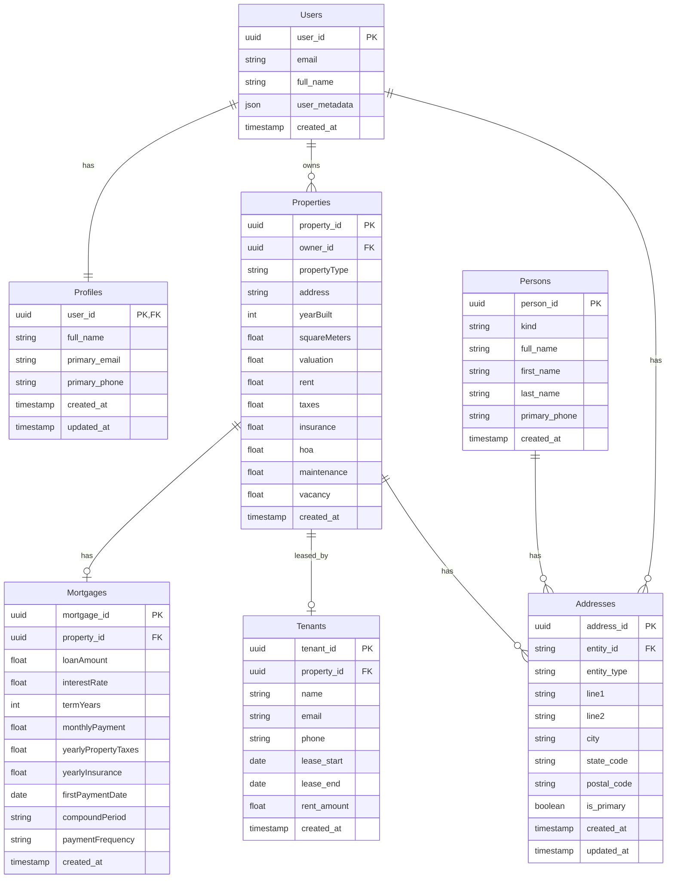

# Diagrama de Entidad-Relación Visual para OwnerIQ

## Notas sobre el diagrama

- La notación utilizada en las relaciones:
  - `||--||`: Relación uno a uno
  - `||--o{`: Relación uno a muchos
  - `||--o|`: Relación uno a cero/uno (opcional)
  
- Entity-type en la tabla Addresses:
  - Esta tabla utiliza un patrón polimórfico donde `entity_type` indica el tipo de entidad ('user', 'property', 'borrower', 'lender')
  - `entity_id` es la clave foránea que apunta a diferentes tablas según el valor de `entity_type`

- Kind en la tabla Persons:
  - Esta tabla utiliza un discriminador donde `kind` indica el tipo específico de persona ('borrower', 'lender')
  - Algunos campos son específicos según el tipo (first_name/last_name para borrowers, full_name para lenders)