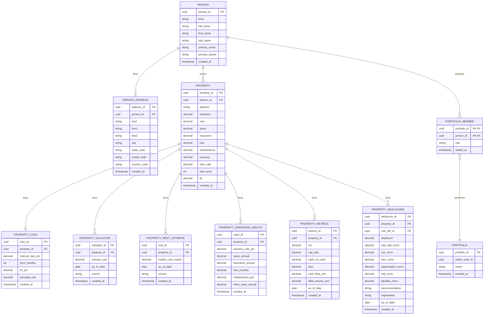

# Diagrama Entidad-Relación (ERD) Simplificado para OwnerIQ

## Entidades Principales

### Person (Persona)
- **person_id** (PK) - UUID
- kind - Tipo de persona ('individual', 'organization')
- full_name - Nombre completo
- first_name - Nombre
- last_name - Apellido
- primary_email - Correo electrónico principal
- primary_phone - Teléfono principal
- created_at - Fecha de creación

### Person_Address (Dirección de Persona)
- **address_id** (PK) - UUID
- person_id (FK) - Referencia a Person
- kind - Tipo de dirección ('home', 'mailing', 'office', 'other')
- line1 - Línea de dirección 1
- line2 - Línea de dirección 2 (opcional)
- city - Ciudad
- state_code - Código de estado/provincia
- postal_code - Código postal
- country_code - Código de país
- created_at - Fecha de creación

### Property (Propiedad)
- **property_id** (PK) - UUID
- person_id (FK) - Referencia al propietario (Person)
- address - Dirección completa
- valuation - Valoración en USD
- rent - Renta mensual
- taxes - Impuestos anuales
- insurance - Seguro anual
- hoa - Cuota mensual de asociación de propietarios
- maintenance - Porcentaje de mantenimiento
- vacancy - Porcentaje de vacancia
- loan_rate - Tasa de préstamo
- loan_term - Plazo del préstamo
- ltv - Relación préstamo-valor
- created_at - Fecha de creación

### Portfolio (Portafolio)
- **portfolio_id** (PK) - UUID
- owner_user_id - ID del usuario propietario
- name - Nombre del portafolio
- created_at - Fecha de creación

### Property_Loan (Préstamo de Propiedad)
- **loan_id** (PK) - UUID
- property_id (FK) - Referencia a Property
- interest_rate_pct - Tasa de interés (porcentaje)
- term_months - Plazo en meses
- ltv_pct - Porcentaje de relación préstamo-valor
- principal_usd - Monto principal del préstamo
- created_at - Fecha de creación

## Relaciones Importantes

1. **Person → Person_Address**: Una persona puede tener múltiples direcciones (1:N)
2. **Person → Property**: Una persona puede poseer múltiples propiedades (1:N)
3. **Property → Property_Loan**: Una propiedad puede tener un préstamo asociado (1:1)
4. **Person → Portfolio_Member → Portfolio**: Personas pueden pertenecer a múltiples portafolios con diferentes roles (N:M)

## Tipos Enumerados Clave

- **person_kind**: 'individual', 'organization'
- **address_kind**: 'home', 'mailing', 'office', 'other'
- **property_type**: 'single_family', 'townhouse', 'condo', 'multi_family', 'commercial'
- **portfolio_role**: 'owner', 'manager', 'viewer'

## Diagrama Visual

## Notas Importantes

1. La entidad `person` es la base para diferentes tipos de usuarios, incluyendo propietarios, prestamistas e inquilinos.

2. Las propiedades tienen múltiples métricas financieras asociadas que se almacenan en tablas separadas para facilitar el seguimiento histórico.

3. El sistema utiliza UUIDs como claves primarias en todas las tablas.

4. Las relaciones entre personas y propiedades son fundamentales para el funcionamiento del sistema.

5. Existen múltiples tablas de métricas y evaluación para propiedades que permiten análisis detallados de rendimiento e inversión.