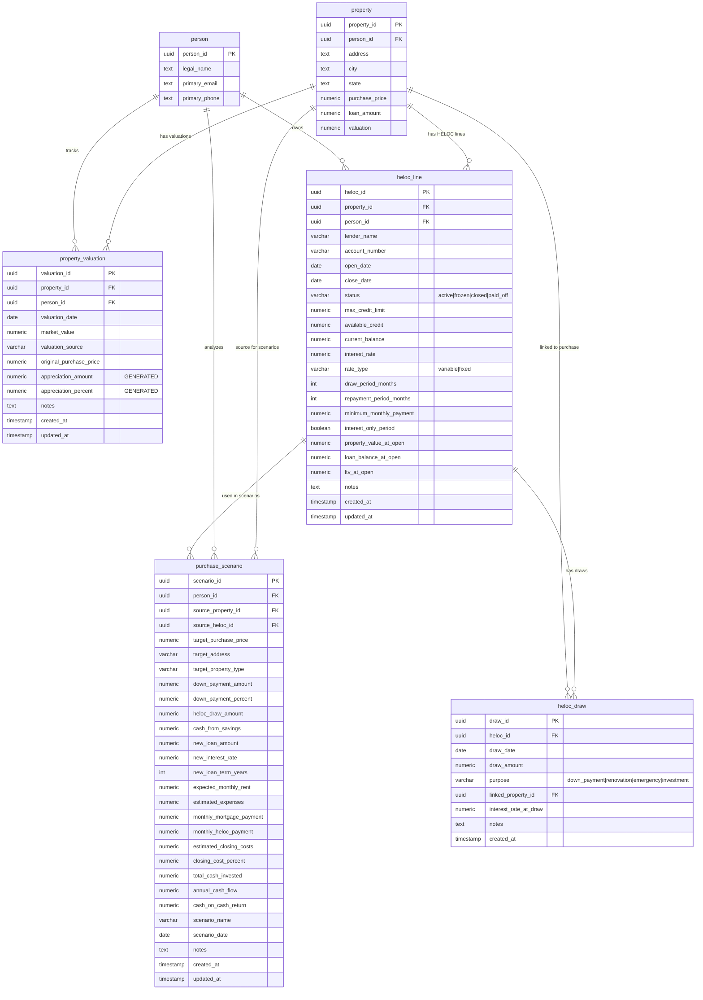

# HELOC Schema Diagram

## Copia y pega este código en https://www.mermaidchart.com/



## Vistas SQL

### current_equity_summary
Muestra el equity actual de todas las propiedades:
- property_id, person_id, address
- original_purchase_price
- current_market_value (más reciente)
- total_appreciation
- appreciation_percent
- current_loan_balance
- current_equity = market_value - loan_amount
- available_heloc_equity = (market_value * 0.80) - loan_amount
- active_heloc_id, heloc_available_credit, heloc_current_balance

### heloc_performance
Muestra el desempeño de cada HELOC:
- heloc_id, property_id, person_id, address
- lender_name, status
- max_credit_limit, available_credit, current_balance
- utilization_rate = current_balance / max_credit_limit
- interest_rate, minimum_monthly_payment
- monthly_interest_cost, annual_interest_cost
- total_draws (count), total_drawn (sum)
- open_date, years_open

## Flujo de Trabajo

1. **Property Valuation** → Actualiza el valor de mercado de una propiedad
2. **Equity Calculation** → Vista calcula equity automáticamente
3. **HELOC Line Creation** → Crea línea de crédito basada en equity disponible
4. **HELOC Draw** → Registra retiro de fondos del HELOC
5. **Purchase Scenario** → Analiza compra de nueva propiedad usando HELOC

## Endpoints API Disponibles

```
GET    /api/heloc/equity-summary              - Ver equity de todas propiedades
GET    /api/heloc/valuations/:propertyId      - Historial de valuaciones
POST   /api/heloc/valuations                  - Agregar nueva valuación
GET    /api/heloc/lines                       - Ver todas las líneas HELOC
GET    /api/heloc/lines/:helocId              - Ver HELOC específico
POST   /api/heloc/lines                       - Crear nueva línea HELOC
PUT    /api/heloc/lines/:helocId              - Actualizar HELOC
GET    /api/heloc/draws/:helocId              - Ver retiros de un HELOC
POST   /api/heloc/draws                       - Registrar nuevo retiro
GET    /api/heloc/scenarios                   - Ver todos los escenarios
POST   /api/heloc/scenarios                   - Crear nuevo escenario
DELETE /api/heloc/scenarios/:scenarioId       - Eliminar escenario
POST   /api/heloc/calculate                   - Calcular escenario HELOC
GET    /api/heloc/performance/:helocId        - Ver performance de HELOC
```

## Ejemplo de Uso

### 1. Actualizar Valuación de Propiedad
```json
POST /api/heloc/valuations
{
  "property_id": "uuid-123",
  "valuation_date": "2025-01-08",
  "market_value": 450000,
  "valuation_source": "zillow",
  "original_purchase_price": 350000
}
```

### 2. Crear Línea HELOC
```json
POST /api/heloc/lines
{
  "property_id": "uuid-123",
  "lender_name": "Wells Fargo",
  "open_date": "2025-01-08",
  "max_credit_limit": 80000,
  "available_credit": 80000,
  "interest_rate": 7.5,
  "property_value_at_open": 450000,
  "loan_balance_at_open": 280000
}
```

### 3. Calcular Escenario de Compra
```json
POST /api/heloc/calculate
{
  "property_value": 450000,
  "current_loan_balance": 280000,
  "purchase_price": 250000,
  "down_payment_percent": 0.20,
  "new_mortgage_rate": 6.5,
  "new_loan_term": 30,
  "expected_monthly_rent": 2500,
  "monthly_expenses": 800,
  "heloc_interest_rate": 7.5
}
```

Respuesta:
```json
{
  "equity_analysis": {
    "current_equity": 170000,
    "available_heloc_equity": 80000,
    "ltv_80_percent": 360000
  },
  "purchase_structure": {
    "down_payment_needed": 50000,
    "heloc_draw": 50000,
    "cash_needed": 0,
    "new_loan_amount": 200000
  },
  "returns": {
    "monthly_mortgage_payment": 1264.14,
    "monthly_heloc_payment": 312.50,
    "monthly_expenses": 800,
    "monthly_rent": 2500,
    "monthly_cash_flow": 123.36,
    "annual_cash_flow": 1480.32,
    "cash_on_cash_return": 0.0296
  }
}
```
