# OwnerIQ Database - Entity Relationship Diagram

## Schema Visual (Mermaid ERD)

```mermaid
erDiagram
    %% ============================================================================
    %% CORE PERSON MANAGEMENT
    %% ============================================================================

    person ||--o{ person_role : "has roles"
    person ||--o{ person_contact : "has contacts"
    person ||--o{ person_address : "has addresses"
    person ||--o{ person_document : "has documents"
    person ||--o{ property : "owns"
    person ||--o{ lease : "rents as tenant"

    person {
        uuid person_id PK
        text kind "individual/organization"
        text full_name
        text first_name
        text last_name
        text primary_email UK
        text primary_phone
        text external_ref
        date dob
        text tax_id_hash
        timestamptz created_at
    }

    person_role {
        uuid person_role_id PK
        uuid person_id FK
        uuid owner_person_id FK
        text role "tenant/lender/advisor"
        text context
        uuid context_id
        date active_from
        date active_to
        timestamptz created_at
    }

    person_contact {
        uuid contact_id PK
        uuid person_id FK
        text kind "email/mobile/phone/whatsapp"
        text value
        boolean is_primary
        text label
        text verification_status
        jsonb metadata
        timestamptz created_at
    }

    person_address {
        uuid address_id PK
        uuid person_id FK
        text kind "home/mailing/office"
        text line1
        text line2
        text city
        text state_code
        text postal_code
        text country_code
        date valid_from
        date valid_to
        text verification_status
        jsonb metadata
        timestamptz created_at
    }

    person_document {
        uuid document_id PK
        uuid person_id FK
        uuid tenancy_id FK
        text kind "w9/lease_agreement/id_document"
        text storage_path
        timestamptz uploaded_at
        date expires_at
        timestamptz verified_at
        jsonb metadata
    }

    %% ============================================================================
    %% PROPERTY MANAGEMENT
    %% ============================================================================

    property ||--o{ property_document : "has documents"
    property ||--o{ property_metrics : "has metrics"
    property ||--o{ property_tenancy : "has tenancies"
    property ||--o{ lease : "has leases"
    property ||--o{ mortgage_summary : "has mortgage"
    property ||--o{ mortgage_payment_schedule : "has payment schedule"

    property {
        uuid property_id PK
        uuid person_id FK "owner"
        text address
        text city
        text state
        text zip_code
        text property_type
        numeric valuation
        numeric purchase_price
        numeric loan_amount
        numeric monthly_payment
        numeric interest_rate
        int term_years
        numeric taxes
        numeric insurance
        numeric rent
        text notes
        timestamptz created_at
        timestamptz updated_at
    }

    property_document {
        uuid document_id PK
        uuid property_id FK
        text document_type
        text file_name
        text file_path
        text file_url
        timestamptz uploaded_at
        jsonb metadata
    }

    property_metrics {
        uuid metrics_id PK
        uuid property_id FK
        numeric noi "Net Operating Income"
        numeric cap_rate "Capitalization Rate"
        numeric cash_on_cash
        numeric dscr "Debt Service Coverage Ratio"
        numeric cash_flow_net
        numeric debt_service_ann
        date as_of_date
        timestamptz created_at
    }

    %% ============================================================================
    %% TENANCY & LEASES
    %% ============================================================================

    property_tenancy ||--o{ property_tenancy_party : "has parties"
    property_tenancy ||--o{ person_document : "has documents"

    property_tenancy {
        uuid tenancy_id PK
        uuid property_id FK
        uuid person_id FK "primary tenant"
        date lease_start
        date lease_end
        numeric rent_amount
        text status "draft/active/delinquent/ended"
        text source
        timestamptz created_at
        timestamptz updated_at
    }

    property_tenancy_party {
        uuid tenancy_party_id PK
        uuid tenancy_id FK
        uuid person_id FK
        text role "primary/co-tenant/guarantor"
    }

    lease ||--o{ rent_invoice : "generates invoices"
    lease ||--o{ payment_transaction : "receives payments"
    lease ||--o{ late_fee_policy : "has policy"

    lease {
        uuid lease_id PK
        uuid property_id FK
        uuid tenant_person_id FK
        uuid portfolio_id FK
        text lease_number UK
        text status "draft/active/expired/terminated"
        date start_date
        date end_date
        numeric monthly_rent
        numeric security_deposit
        int rent_due_day
        boolean auto_generate_invoices
        boolean allow_partial_payments
        text notes
        timestamptz created_at
        timestamptz updated_at
    }

    %% ============================================================================
    %% RENT COLLECTION SYSTEM
    %% ============================================================================

    rent_invoice ||--o{ rent_invoice_adjustment : "has adjustments"
    rent_invoice ||--o{ payment_transaction : "has payments"

    rent_invoice {
        uuid invoice_id PK
        uuid lease_id FK
        int period_year
        int period_month
        text invoice_number UK
        date issue_date
        date due_date
        date paid_date
        numeric base_amount
        numeric adjustments_total
        numeric amount_due
        numeric amount_paid
        text status "pending/partial/paid/late/void"
        text notes
        timestamptz created_at
        timestamptz updated_at
    }

    rent_invoice_adjustment {
        uuid adj_id PK
        uuid invoice_id FK
        text kind "late_fee/discount/credit/refund"
        numeric amount_delta
        text reason
        date applied_date
        uuid applied_by
        text notes
        timestamptz created_at
    }

    payment_transaction {
        uuid payment_id PK
        uuid invoice_id FK
        uuid lease_id FK
        text payment_number UK
        text method "stripe_card/ach/cash/check"
        text external_id
        numeric amount_usd
        numeric fee_usd
        numeric net_amount
        text status "initiated/pending/succeeded/failed"
        timestamptz initiated_at
        timestamptz received_at
        timestamptz confirmed_at
        text payer_name
        text reference_number
        jsonb payload
        timestamptz created_at
    }

    late_fee_policy {
        uuid policy_id PK
        uuid lease_id FK
        uuid portfolio_id FK
        int grace_days
        text mode "fixed/percent/daily/compound"
        numeric fixed_amount
        numeric percent_rate
        numeric daily_amount
        numeric max_cap
        int max_applications
        boolean is_active
        timestamptz created_at
    }

    %% ============================================================================
    %% ACCOUNTING
    %% ============================================================================

    account ||--o{ journal_line : "has entries"
    journal_entry ||--o{ journal_line : "has lines"

    account {
        uuid account_id PK
        uuid portfolio_id FK
        text code
        text name
        text type "asset/liability/equity/income/expense"
        uuid parent_account_id FK
        boolean is_active
        timestamptz created_at
    }

    journal_entry {
        uuid journal_id PK
        uuid portfolio_id FK
        text entry_number UK
        date entry_date
        text memo
        text reference_type
        uuid reference_id
        boolean is_posted
        timestamptz posted_at
        uuid created_by
        timestamptz created_at
    }

    journal_line {
        uuid line_id PK
        uuid journal_id FK
        uuid account_id FK
        uuid property_id FK
        numeric amount_usd
        text dr_cr "DR/CR"
        text memo
        timestamptz created_at
    }

    %% ============================================================================
    %% MORTGAGE TRACKING
    %% ============================================================================

    mortgage_summary {
        uuid summary_id PK
        uuid property_id FK
        numeric loan_amount
        numeric interest_rate
        int term_months
        numeric monthly_payment_piti
        numeric total_interest
        numeric total_payments
        date first_payment_date
        timestamptz created_at
    }

    mortgage_payment_schedule {
        uuid schedule_id PK
        uuid property_id FK
        int payment_number
        date payment_date
        numeric principal_paid
        numeric interest_due
        numeric balance
        numeric cumulative_interest
        numeric cumulative_principal
        timestamptz created_at
    }

    %% ============================================================================
    %% AUDIT
    %% ============================================================================

    rent_audit_log {
        uuid audit_id PK
        text table_name
        uuid record_id
        text operation "INSERT/UPDATE/DELETE"
        jsonb old_data
        jsonb new_data
        text[] changed_fields
        uuid changed_by
        timestamptz changed_at
        inet ip_address
        text user_agent
    }

    %% ============================================================================
    %% AI DOCUMENT PIPELINE
    %% ============================================================================

    documents ||--o{ document_pages : "has pages"
    documents ||--o{ extracted_fields : "has fields"
    documents ||--o{ document_validations : "has validations"
    documents ||--o{ processing_logs : "has logs"

    documents {
        uuid document_id PK
        uuid property_id FK
        uuid user_id FK
        text document_type
        numeric classification_confidence
        text classification_reasoning
        text filename
        text file_hash UK
        int file_size
        text mime_type
        text raw_text
        int page_count
        text status "pending/processing/completed/failed"
        text ai_model
        int ai_tokens_used
        int processing_duration_ms
        numeric extraction_confidence
        timestamptz uploaded_at
        timestamptz processing_started_at
        timestamptz processing_completed_at
        jsonb metadata
    }

    document_pages {
        uuid page_id PK
        uuid document_id FK
        int page_number
        text text
        jsonb metadata
        timestamptz created_at
    }

    extracted_fields {
        uuid field_id PK
        uuid document_id FK
        uuid page_id FK
        text field_name
        text field_value
        jsonb normalized_value
        numeric confidence
        text source_text
        int source_page_number
        timestamptz created_at
        timestamptz updated_at
    }

    document_validations {
        uuid validation_id PK
        uuid document_id FK
        text validation_type "error/warning/info"
        text severity "critical/high/medium/low"
        text field_name
        text message
        timestamptz created_at
    }

    processing_logs {
        uuid log_id PK
        uuid document_id FK
        text stage "ingestion/classification/extraction/validation"
        text status "started/completed/failed"
        text message
        jsonb data
        timestamptz created_at
    }
```

## Relaciones Principales

### 1. Person → Property (Ownership)
- Una persona puede tener múltiples propiedades
- `property.person_id` → `person.person_id`

### 2. Person → Person Role (Multi-role)
- Una persona puede tener múltiples roles (tenant, lender, advisor)
- `person_role.person_id` → `person.person_id`
- `person_role.owner_person_id` → `person.person_id` (quien define el rol)

### 3. Property → Lease → Rent Invoice
- Una propiedad tiene múltiples leases
- Un lease genera múltiples facturas mensuales
- `lease.property_id` → `property.property_id`
- `rent_invoice.lease_id` → `lease.lease_id`

### 4. Rent Invoice → Payment Transaction
- Una factura puede tener múltiples pagos
- `payment_transaction.invoice_id` → `rent_invoice.invoice_id`

### 5. Property → Mortgage Schedule
- Una propiedad tiene un resumen de hipoteca
- Una propiedad tiene 360 pagos programados (30 años)
- `mortgage_summary.property_id` → `property.property_id`
- `mortgage_payment_schedule.property_id` → `property.property_id`

### 6. Document Pipeline
- Documentos procesados por IA se relacionan con propiedades
- `documents.property_id` → `property.property_id`

## Índices Importantes

### Person Management
- `person.primary_email` (UNIQUE)
- `person_role(person_id, owner_person_id, role)`
- `person_contact(person_id, kind)` WHERE is_primary

### Property & Leases
- `property.person_id`
- `lease(property_id, tenant_person_id)`
- `lease.lease_number` (UNIQUE)

### Rent Collection
- `rent_invoice(lease_id, period_year, period_month)` (UNIQUE)
- `rent_invoice.invoice_number` (UNIQUE)
- `rent_invoice.status`
- `rent_invoice.due_date`

### Payments
- `payment_transaction.invoice_id`
- `payment_transaction.lease_id`
- `payment_transaction.status`

## Triggers Activos

1. **update_lease_timestamp()** - Actualiza `updated_at` en lease
2. **set_lease_number()** - Auto-genera `lease_number`
3. **recalculate_invoice_amount()** - Recalcula totales en rent_invoice
4. **update_property_status_on_lease_change()** - Placeholder para futuro uso

## Funciones Principales

### Rent Collection
- `gen_rent_invoices(date)` - Genera facturas mensuales
- `apply_late_fees(date)` - Aplica late fees automáticos
- `apply_payment_to_invoices(payment_id)` - Aplica pagos FIFO
- `create_payment_journal_entry(payment_id)` - Crea asiento contable

### Manual Operations
- `apply_late_fees_manual(invoice_id, date)`
- `register_payment_manual(lease_id, amount, method, payer, date)`
- `create_invoice_manual(lease_id, year, month, amount, due_date)`

### Utilities
- `generate_invoice_number(lease_id, year, month)`
- `generate_payment_number()`
- `generate_lease_number()`
- `calculate_invoice_balance(invoice_id)`

## Vistas Útiles

1. **v_rent_invoice_detail** - Facturas con info de lease y tenant
2. **v_payment_detail** - Pagos con info completa
3. **v_property_with_occupancy** - Propiedades con estado de ocupación
4. **v_lease_balance** - Balance por lease

## Tipos/Enums Activos

- `person_kind` (individual, organization)
- `contact_kind` (email, mobile, phone, whatsapp, telegram, other)
- `address_kind` (home, mailing, office, other)
- `person_role_kind` (tenant, lender, investor_contact, advisor)
- `tenancy_status` (draft, active, delinquent, ended)
- `tenancy_party_role` (primary, co-tenant, guarantor)
- `person_document_kind` (w9, lease_agreement, id_document, other)
- `lease_status` (draft, active, expired, terminated, renewed)
- `invoice_status` (pending, partial, paid, late, void, cancelled)
- `payment_method` (stripe_card, stripe_ach, cash, check, wire, zelle, venmo, other)
- `payment_status` (initiated, pending, succeeded, failed, refunded, cancelled)
- `adjustment_kind` (late_fee, discount, credit, misc, refund, proration)
- `late_fee_mode` (fixed, percent, daily, compound)
- `account_type` (asset, liability, equity, income, expense)
- `dr_cr` (DR, CR)

---

**Total de Tablas Activas:** 18
**Total de Relaciones:** 25+
**Total de Índices:** 40+
**Total de Funciones:** 12+
**Total de Triggers:** 4

Este diagrama representa el schema limpio después de eliminar las 20 tablas no utilizadas.
