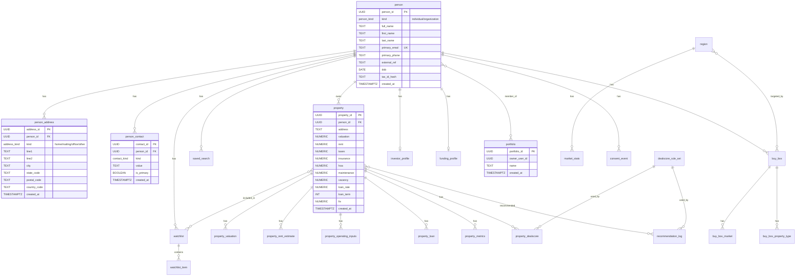

# Diagrama Entidad-Relación (ERD) para OwnerIQ

Este diagrama muestra las principales entidades y relaciones en la base de datos de OwnerIQ.

## Estructura de la Base de Datos



## Explicación

1. **person**: Tabla central que almacena información de personas (individuos u organizaciones)
2. **person_address**: Almacena direcciones asociadas a una persona
3. **person_contact**: Almacena información de contacto (email, teléfono, etc.)
4. **property**: Propiedades inmobiliarias en el sistema
5. **portfolio**: Colecciones de propiedades

## Problema Identificado

El código de la aplicación en `handleAddressSubmit()` (App.js) y `handleProfileUpdate()` está intentando manipular el campo `is_primary` en la tabla `person_address`, pero este campo **no existe** en el esquema actual según el archivo schema.sql. Esto podría estar causando que las actualizaciones a las direcciones no funcionen correctamente.

## Solución Propuesta

Modificar el esquema para agregar el campo `is_primary` a la tabla `person_address`:

```sql
ALTER TABLE person_address ADD COLUMN is_primary BOOLEAN NOT NULL DEFAULT FALSE;
CREATE UNIQUE INDEX IF NOT EXISTS u_person_primary_address
  ON person_address(person_id) WHERE is_primary;
```

Esta modificación hará que la estructura de la tabla `person_address` sea coherente con lo que el código espera, lo que debería resolver el problema de actualizaciones.