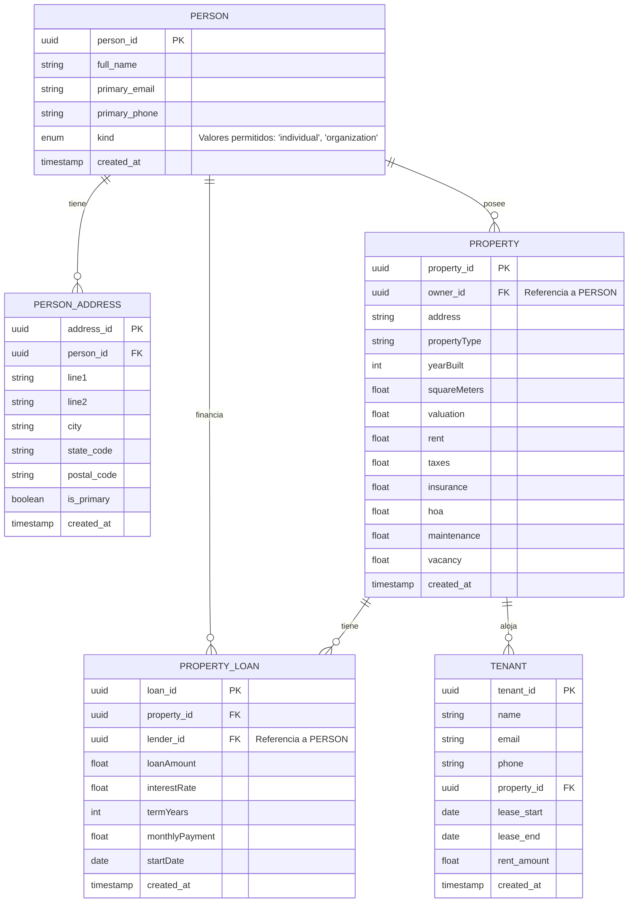

# Diagrama ER Simplificado

## Descripción de las Entidades

### PERSON
Esta entidad contiene información sobre personas, con el campo `kind` como discriminador para identificar los diferentes tipos:
- `user`: Usuarios de la aplicación
- `borrower`: Prestatarios 
- `lender`: Prestamistas

### PERSON_ADDRESS
Almacena las direcciones asociadas a las personas, con la capacidad de marcar una dirección como principal.

### PROPERTY
Contiene información sobre propiedades inmobiliarias, incluyendo datos como valoración, renta, impuestos, etc.

### PROPERTY_LOAN
Almacena información sobre préstamos asociados a propiedades, incluyendo datos como monto, tasa de interés, plazos, etc.

### TENANT
Contiene información sobre inquilinos, incluyendo sus contratos de arrendamiento asociados a propiedades.

## Relaciones Principales

1. Una PERSONA puede tener múltiples DIRECCIONES (PERSON_ADDRESS)
2. Una PERSONA puede poseer múltiples PROPIEDADES (PROPERTY)
3. Una PERSONA (lender) puede financiar múltiples PRÉSTAMOS (PROPERTY_LOAN)
4. Una PROPIEDAD puede tener múltiples PRÉSTAMOS (PROPERTY_LOAN)
5. Una PROPIEDAD puede alojar a múltiples INQUILINOS (TENANT)

## Notas Importantes

- La tabla PERSON usa el campo `kind` como discriminador para diferenciar entre usuarios, prestatarios y prestamistas
- No existe un campo `updated_at` en la tabla PERSON, lo que causaba el error en la aplicación
- Los campos de tipo timestamp utilizan ISO 8601 (formato estándar: YYYY-MM-DDTHH:MM:SS.sssZ)