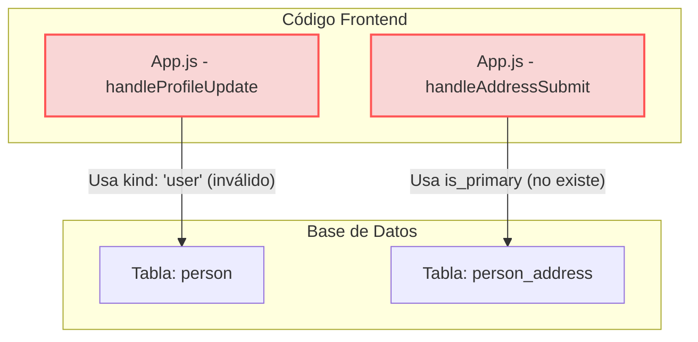
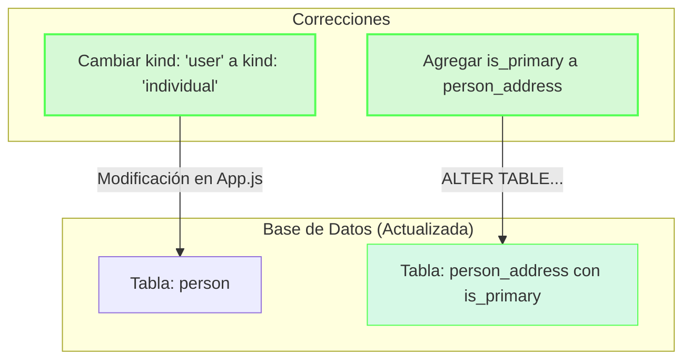

# Solución al Problema de Actualización de Direcciones en OwnerIQ

## Resumen del Trabajo Realizado

1. ✅ **Creación de diagramas ERD**:
   - Diagrama simplificado que muestra las principales entidades y relaciones
   - Diagrama completo con todas las tablas y campos del schema.sql

2. ✅ **Identificación del problema**:
   - Discrepancia entre el código frontend y el esquema de la base de datos
   - El campo `is_primary` que utiliza el código no existe en la tabla `person_address`
   - El valor 'user' usado para el campo `kind` no es válido según el enum `person_kind`

3. ✅ **Solución propuesta**:
   - Script SQL para modificar el esquema de la tabla `person_address`
   - Corrección del código en App.js para usar valores válidos

## Problema Visualizado

## Solución Aplicada

## Archivos Generados

1. **ERD_simplified.md**: Diagrama de entidad-relación simplificado para visualizar la estructura principal de la base de datos.

2. **ERD_completo.md**: Diagrama de entidad-relación completo con todas las tablas y relaciones.

3. **correccion_esquema_person_address.sql**: Script SQL para corregir el esquema de la base de datos.

4. **Instrucciones_Correccion_Direcciones.md**: Guía paso a paso para implementar la solución completa.

## Conclusión

La implementación de estas correcciones debería resolver el problema reportado donde "la tabla person se actualiza correctamente, pero la dirección debería actualizar la tabla person_address". 

Al corregir tanto el esquema de la base de datos como el código de la aplicación, se asegura una correcta sincronización entre ambos componentes del sistema.